> 流式计算相关概念。

# 1.流式计算

## 1.1 大数据处理的四个场景

* 长时间运行的批式数据处理（Hadoop MapReduce、Spark等）

* 实时运行的流式数据处理（Flink、SparkStreaming等）

* 交互式运行的数据查询（秒级或者毫秒级，OLAP引擎等）

* 大规模的智能模型的训练和部署（大数据链路与AI打通）

## 1.2 概念
流式计算(stream processing)是用于处理无界数据集的计算，包括真正的流式和通过微批(micro-batch)方式实现的流式计算。

— "A type of data processing engine that is designed with infinite data sets in mind. " – Streaming 101: The world beyond
batch.

## 1.3 特点
* ***实时(realtime)且无界(unbounded)的数据流***
数据源产出的数据，实时地被流计算订阅和消费。
* ***持续(continuos)且高效（high-performance）的计算***
流计算作为一种"事件触发"的计算模式，一旦有新的源数据进入，立即发起一次计算任务。
* ***流式(streaming)且实时(realtime)的数据集成***
流数据触发一次流计算的结果，类似流数据一样，可以直接写入目的存储。

## 1.4 价值
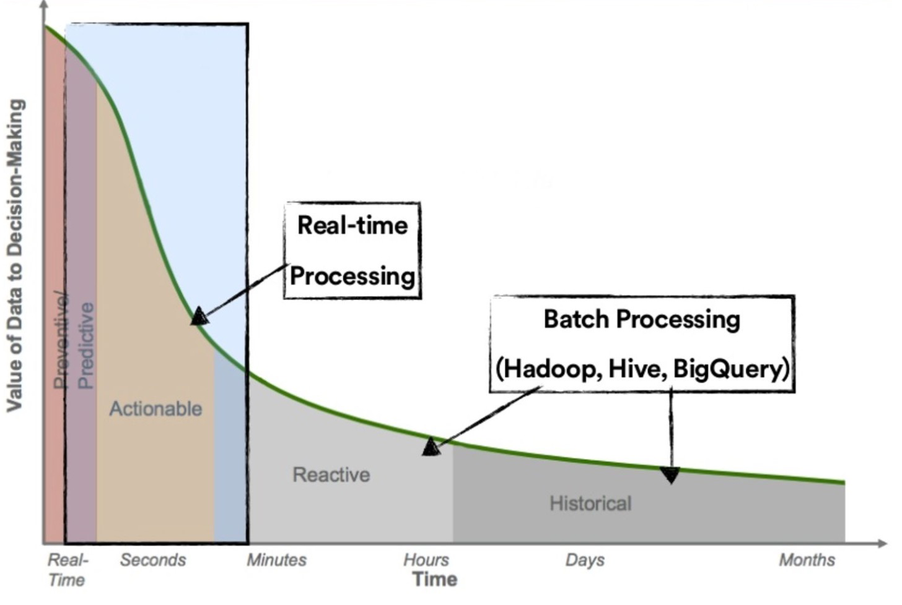

# 2. 核心概念
* 有状态(Stateful)和无状态(Stateless)
    + 无状态的数据流处理(Stateless Processing):处理当前数据时无需了解历史数据。比如: 数据清洗。
    + 有状态的数据流处理(Stateful Processing): 处理当前数据时，需要使用历史数据或其产生的中间结果。比如:各种聚合计算(count/sum/min /max等)、数据Join。
    
    对于有状态的数据流处理，当发生故障时，需要恢复状态数据。
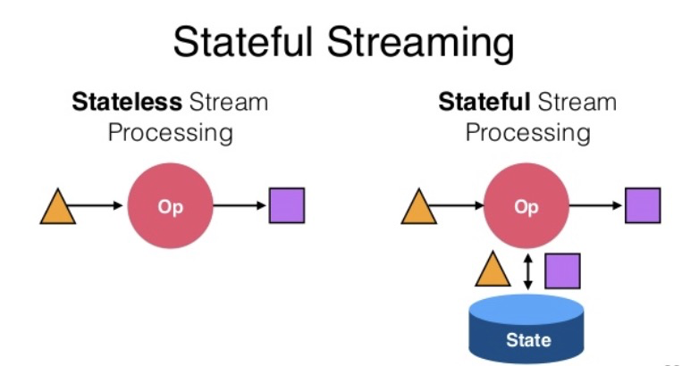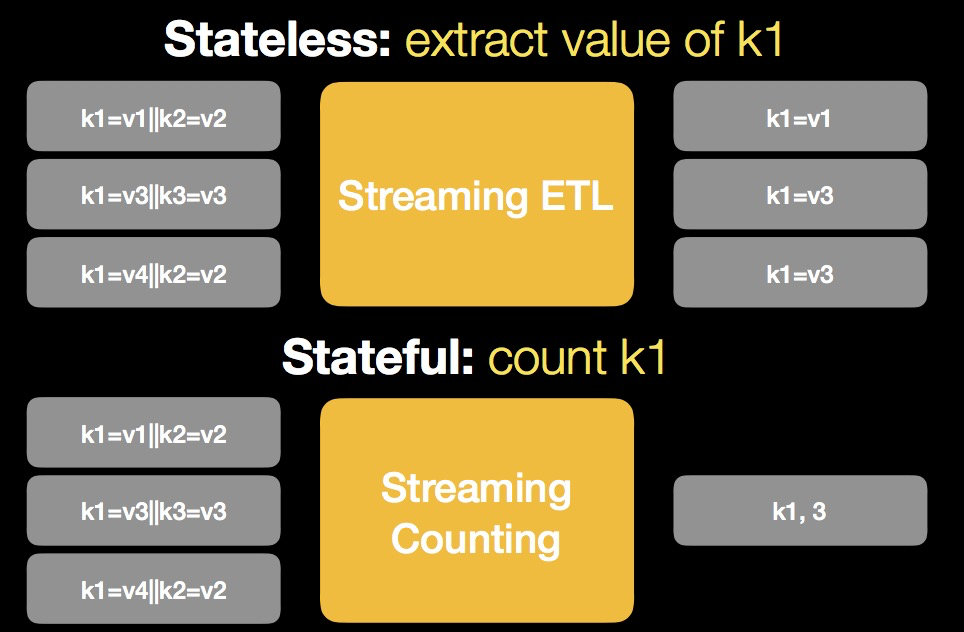

  大多数有状态计算任务的性能瓶颈在于外部状态数据的IO。
* 检查点(checkpoint)和保存点(savepoint)
    +  checkpoint
        
        流式任务通常需要长时间运行，当出现故障时，从头再来不现实。所以添加一种机制，定期记录系统状态快照，例如消费的offset。 当出现故障时，恢复最新的快照，重新处理。
    
        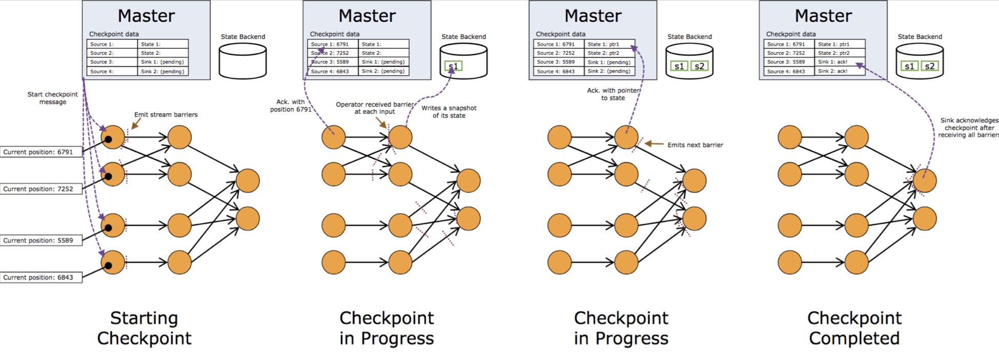
    + savepoint
        + 定期对job做快照，存储kafka offset、in-flight sessions和应用状态 
        + 从savepoint重启一个job，而不是最开始

        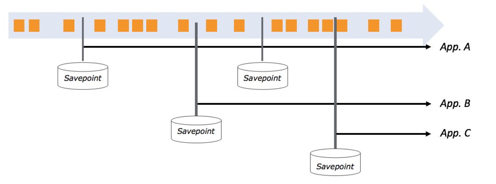
* 时间(Time)
    + Event Time: 数据产生的时间 
    + Ingestion Time: 接收数据的时间 
    + Processing Time:处理数据的时间

    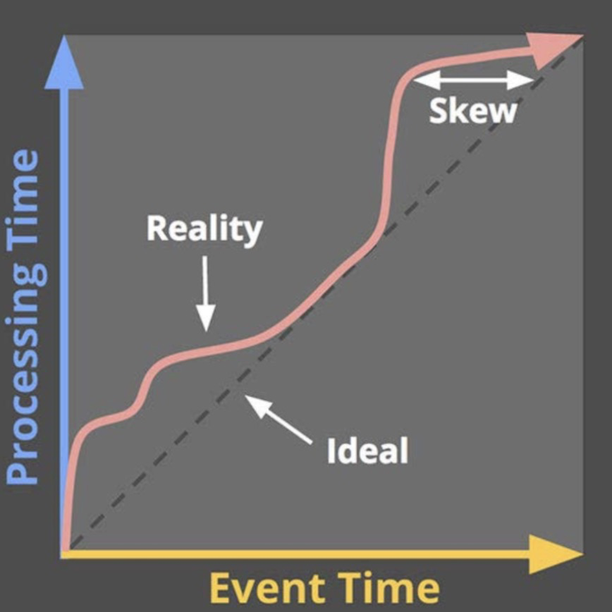
* 水印(waterMark)
用于处理迟到、乱序数据的机制;通常用时间戳表示，作为特殊事件注入到数据流中。表示t时刻之前的数据已经达到。
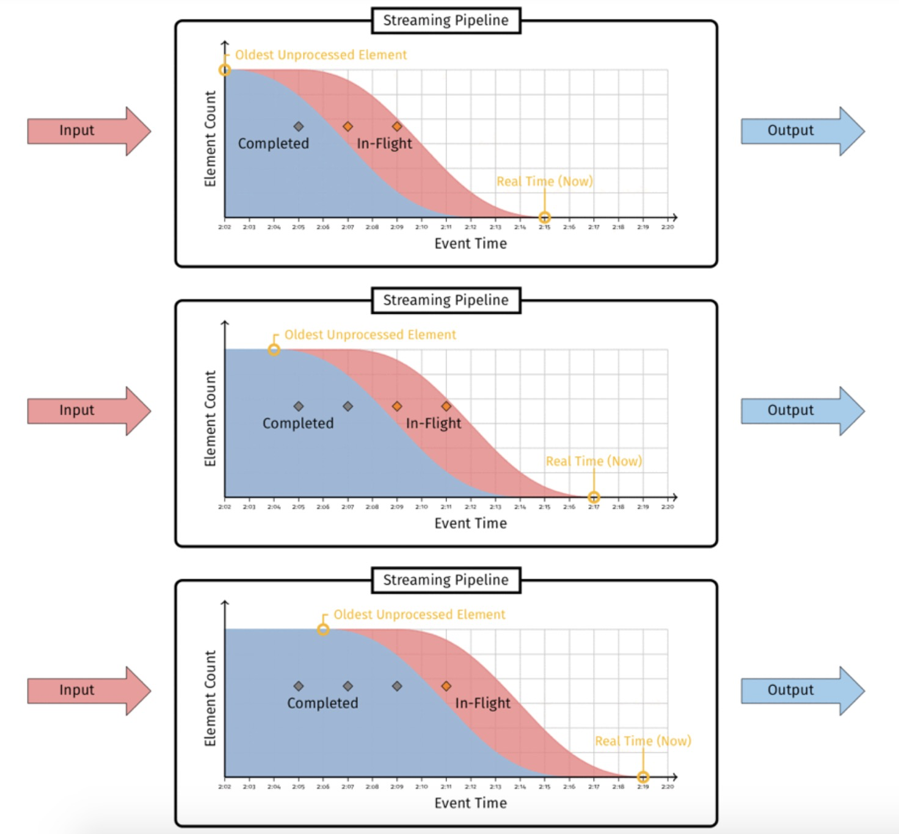
基于eventtime，新消息进入流计算系统时，是待处理状态(in-fligt)，被处理完成后，变成处理完成(completed)状态。 
这个分布图的关键点，是待处理消息最左边的那条边界线(即红色和蓝色部分中间的边界线)，这条线代表了管道中待处理数据的最早时间戳。我们用这条线来定义watermark:
Watermark是单调递增的，管道中最早的待处理数据的事件时间戳。
* 窗口机制(Windows)
    + Fixed/Tumbling Window: 固定大小，不重叠 
    + Sliding Window: 固定大小，有重叠
    + Session Window: 不固定大小，根据时间、事件划分

    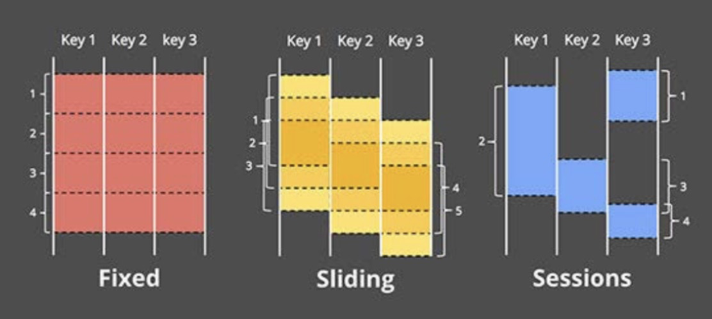
* 一致性语义(Delivery Guarantees)
    + at-most-once: 数据没有保障 
    + at-least-once:可能有重复数据 
    + exactly-once:数据只被处理一次

# 3. 流式计算平台对比
## 3.1 流式计算引擎选型
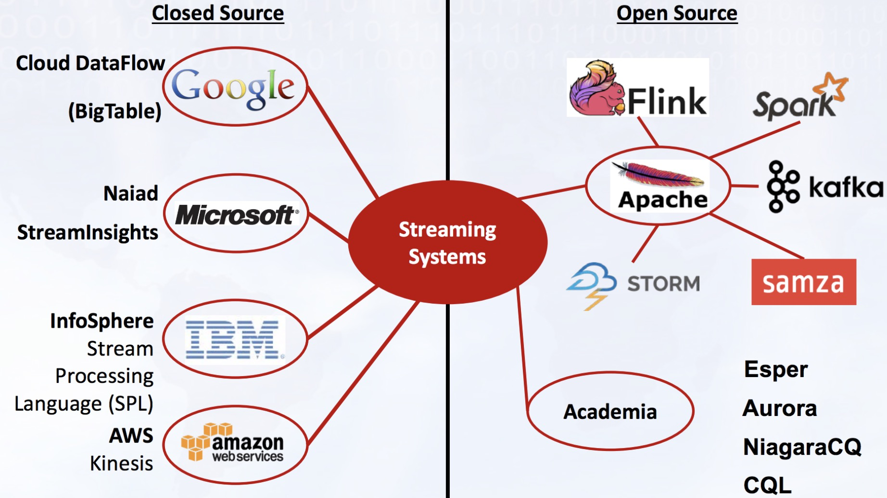
## 3.2 Spark Streaming模型
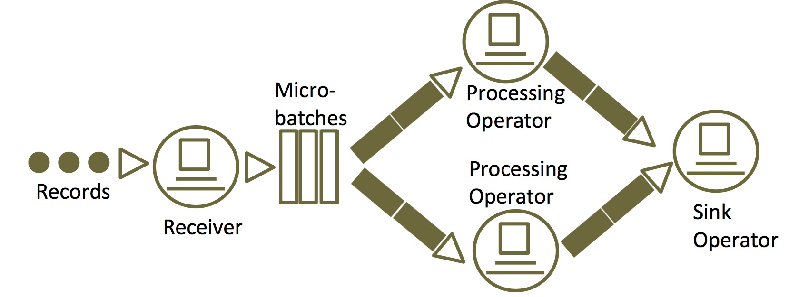
* Micro-Batch模式:将数据切分成小批次，每个批次按批处理逻辑计算 
* 最小延时:batch的处理时间
* 最大延时:batch interval(通常2s ~ 10s)+ * batch的处理时间 
* 使用场景:数据清洗(实时数据通道)、数据ETL等 
* 对于熟悉Spark批量处理的容易上手
* 相对成熟，生态丰富

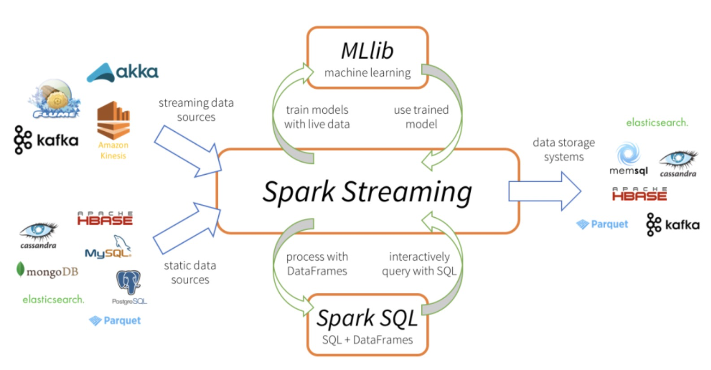

## 3.3 Flink Streaming模型
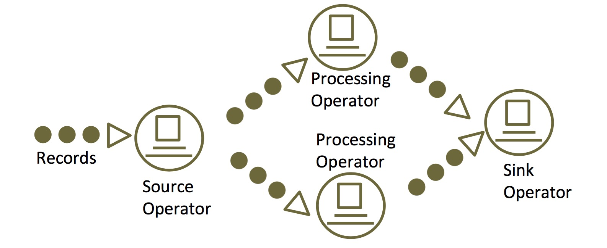
* Native Streaming模式(Native Streaming 计算模式认为 "批是流的特例"):每次处理一条数据 
* 低延时，通常在毫秒级 
* 使用场景:事件驱动的应用(作弊检测、异常检测、基于规则的报警、业务流程监控等)、实时风控、在线业务等 
* 支持Event time
* 窗口灵活 
* 状态管理 
* CEP

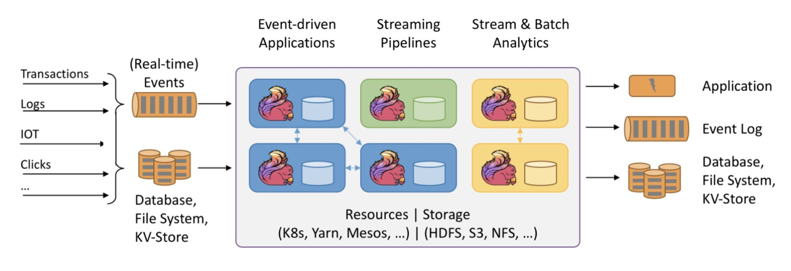

## 3.4 Lambda Architecture & Kappa Architecture
* Lambda Architecture
    + Storm作者Nathan Marz提出 
    + 目前最常见的数据处理架构 
    + 批处理+流计算
        + 流计算输出低延迟、近似结果
        + 通过批处理得到精确数据

    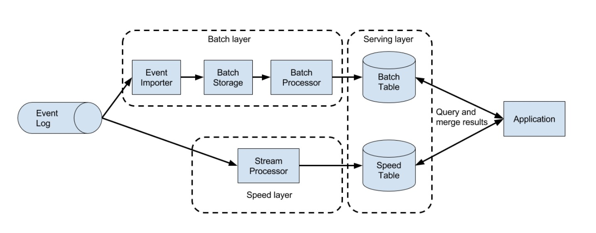

* Kappa Architecture
    + Linkedin的Jay Kreps提出 
    + 简化Lambda架构，避免两套代码、架构 
    + 流计算代替批处理，所有的数据都走流式，要求保证结果一致

    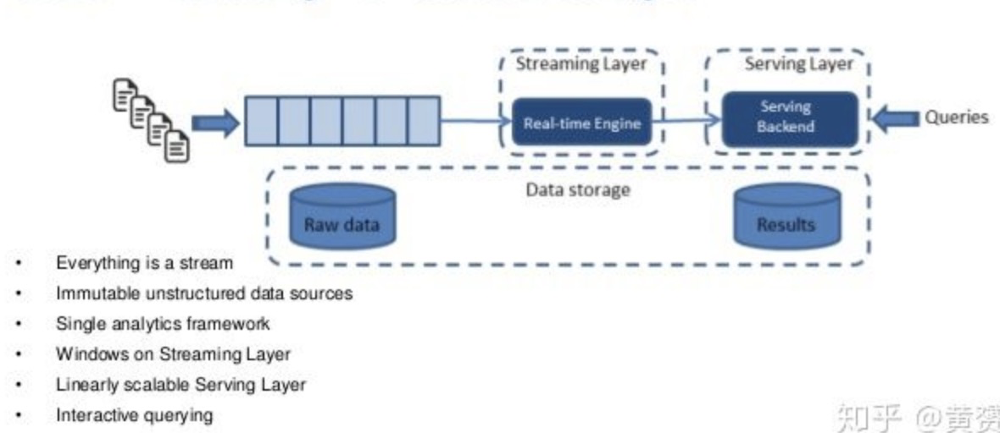

# 4. 性能调优
目标:低延时、高吞吐、水平扩展
* 优化执行计划
* 并行化算子
* Efficient network stack 
* 内存管理
* Share nothing, hopefully
* Async
* Prevent scheduling latency 
* Serialization / deserialization

# 5. 常见的技术方案
* 流式计算 + 实时存储 or 消息队列 
* 流式计算 + 实时OLAP

# 6. 典型的流式计算应用场景

* [Event-driven Application](https://flink.apache.org/usecases.html#eventDrivenApps)

* [Data Analytics Application](https://flink.apache.org/usecases.html#analytics)

* [Data Pipeline Application](https://flink.apache.org/usecases.html#pipelines)

# 7. 参考资料
* [Introduction to Stateful Stream Processing](https://www.oreilly.com/library/view/stream-processing-with/9781491974285/ch01.html)
* [Streaming 101: The world beyond batch](https://www.oreilly.com/radar/the-world-beyond-batch-streaming-101/)
* [Streaming 102: The world beyond batch](https://www.oreilly.com/radar/the-world-beyond-batch-streaming-102/)
* [大数据系统的Lambda架构](https://zhuanlan.zhihu.com/p/20510974)
* [Stream System - WaterMark](https://developer.aliyun.com/article/682873)
